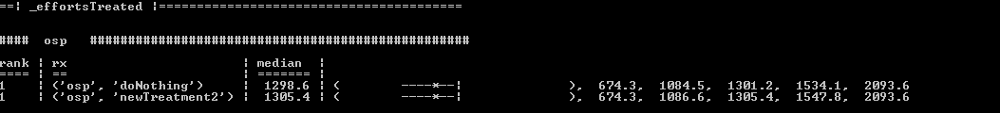

# Homework3

# Theory-1: COCOMO

* **List1 (scale factors):**
*  Prec: have we done this before?
   If Prec goes up from thoroughly unprecedented to throughly familiar, the effort will decrease dramatically
*  Flex: development flexibility
   If Flex goes up from rigorous to general goals, the effort will increase dramatically
*  Resl: any risk resolution activities?
   If Resl goes up from little to full, the effort will increase exponentially
*  Team: team cohesion
   If Team goes up from very difficult interactions to seamless interactions, the effort will decrease dramatically
*  Pmat: process maturity
   Based on weighted average of "Yes" answers to CMM Manturity Questionnaire
* **List2 (uppsies):**
*  acap: analyst capability
   If acap goes up from 15th percentile to 90th percentile, the effort will decrease linearly
*  pcap: programmer capability
   If pcap goes up from 15th percentile to 90th percentile, the effort will decrease linearly
*  pcon: programmer continutiy
   If goes up from 48%/year to 3%/year, the effort will decrease linearly
*  aexp: analyst experience
   If goes up from 2 months to 6 years, the effort will decrease linearly
*  pexp: programmer experience
   If goes up from 2 months to 6 years, the effort will decrease linearly
*  ltex: language and tool experience
   If goes up from 2 months to 6 years, the effort will decrease linearly
*  tool: use of tools
   If goes up from "edit, code, debug" to "strong, mature, proactive lifecycle tools, well integrated with processes, methods, reuse", the effort will decrease linearly
*  site: multiple site development
   If goes up from international to fully collocated, the effort will decrease linearly
*  sced: length of schedule 
   If goes up from "75% of nominal" to 160%, the effort will decrease linearly
* **List3 (downsies):**
*  rely: required reliability
   If rely goes up from slight inconvenience to risk to human life, the effort will increase linearly
*  data: secondary memory storage requirements
   If data goes up from D/P<10 to D/P>1000, the effort will increase linearly.
*  cplx: program complexity
   If cplx goes up from easy to difficult, the effort will increase linearly.
*  ruse: software reuse
   If ruse goes up from none to across multiple, the effort will increase linearly.
*  docu: documentation requirements
   If docu goes up from "Many life-cycle needs uncovered" to "Very excessive for life-cycle needs", the effort will increase linearly.
*  time: runtime pressure
   If time goes up from 50% use of available exectuion time to 95%, the effort will increase linearly.
*  stor: main memory requirements
   If stor goes up from 50% use of available storage to 95%, the effort will increase linearly.
*  pvol: platform volatility
   If pvol goes up from "major change every 12 month and minor change every 1 month to major 2 weeks and minor 2 days", the effort will increase linearly.

# Theory-2: Treatments (management actions)

* **improvePersonnel:** This function changes the COCOMO parameters that belong to Personnel Factors categories of effort multipliers. It sets all those effort multipliers (acap, pcap, aexp, pexp, ltex, pcon) to very high (vhigh). A management will choose to do this when they are running out of time to complete a project and they decide to hire the best possible work-force, platforms and programming language.

* **relaxSchedule:** This function increases the value of Required Development Schedule (sced) to a very high level which gives us a stretch-out of 160%. This is a sign of good management skill because an accelerated schedule (low values) tend to produce more effort in the later phases of development. A stretch-out of a schedule produces more effort in the earlier phases of development where there is more time for thorough planning, specification and validation.

* **improveTeam:** This functions increases the scaling factor Team to a very high value. This is good for management because now they have stakeholders (users, customers, developers, maintainers, others) who are consistent with their objectives and are willing to accommodate other stakeholders' objective too. The stakeholders are working as a team to achieve share vision and commitments.

# Theory-3: Projects
*	**Differences between flight and ground:**
	*	**Product Complexity (CPLX):** flight has cplx in the range [nom,xhigh], while ground has cplx in the range [vlow,high]. This means the tasks in project flights are very difficult and may contain highly coupled objects, analysis of noisy data, complex parallelization, distributed computing, unstructured data etc., whereas the tasks in flight go only as far as evaluating moderate-level expressions, simple triggers, voice recognition, I/O optimization etc.
	*	**Required Software Reliability (RELY):** flight has rely in the range[nom,vhigh], while ground has rely in the range[vlow,high]. This means the effect of software failure is slightly to moderately inconvenience in JPL Ground systems, might also lead to financial loss, but it cannot lead to loss of human life, which is quite possible in JPL Flight systems.
	*	**Lines of Code (KLOC):** Quite evidently, JPL Flight systems has larger codebase due to increased complexity of the product and risk of software reliability.

*	**Differences between osp and osp2:**
	*	**Multisite Development (SITE):** osp has nominal (3) value for site, whereas, osp2 has extra high value for site. Maybe the management decided to discuss the proceedings of the 	project over tele-conferences or other multimedia means rather than discussing them over emails.
	*	**Precedentedness (PREC):** osp has very low to low value for prec, whereas osp2 has prec in the range[nom,vhigh]. This actually makes sense because as a project develops, understanding of product objectives increases, which may enable management to identify related software systems, and do away with developing new and complex systems.
	*	**Use of Software Tools (TOOL):** osp has low to nominal value for tool, whereas, osp2 has only very high value for tool. The management decided to move from basic lifecycle tools to strong, mature, proactive lifecycle tools, well integrated with processes and methods.

# Theory 4

**Table 1:**

**Stink[('sced','aexp')] = [ 
 	[4,2,1,0,0,0], 
 	[2,1,0,0,0,0], 
 	[1,0,0,0,0,0], 
 	[0,0,0,0,0,0], 
 	[0,0,0,0,0,0], 
 	[0,0,0,0,0,0]] **
 
- If the schedule is tight and the project is being worked upon by a team with very limited applications experience(say, less than 2months) in that domain.
- The learning curve for the team to catch up on the project would be much higher to meet the project deadlines.
- This could be one major bad smell for the project under consideration.

**Table 2:**

**Stink[('cplx','tool')] = [ 
 	[0,0,0,0,0,0], 
 	[0,0,0,0,0,0], 
	[0,0,0,0,0,0], 
 	[1,0,0,0,0,0], 
 	[2,1,0,0,0,0], 
 	[4,2,1,0,0,0]] **

- Suppose a team has started working on a highly complex software project with very basic tools and the management decides to cut down 
on the resources. 
- In such a scenario, even if the project demands more sophisticated tools with additional features which would make work easier, the 
team will be forced to work with insufficient tools/resources thus requiring more effort leading to a 'bad smell'.

**Table 3:**

**Stink[('rely','pcap')] = [ 
 	[0,0,0,0,0,0], 
 	[0,0,0,0,0,0], 
 	[1,0,0,0,0,0], 
 	[2,1,0,0,0,0], 
 	[4,2,1,0,0,0], 
 	[0,0,0,0,0,0]] **
 
 - Suppose an organisation has a newly formed team. 
 - This team consists of members hailing from several different organizations and teams. Not all have been working with the same 
 software development lifecycle models. Some followed agile, some the waterfall or even the spiral. Hence, the team still hasn't 
 established a concrete daily workflow.
 - At the same time if the team requires to be working with highly critical health care software, it will possibly be a bad smell 
 for the project given the low level of communication, different methods being followed and the high reliability that the software 
 requires.
 
# Practice

**Task 1**
- data = [2], nkloc=[0.5], rely = [5], pcap = [3]

**Task 2**
- cplx = [4], Pmat = [5], pcap = [4]

**Task 3**
- cplx = [4], pcap = [4], data = [2], nkloc=[0.5]

